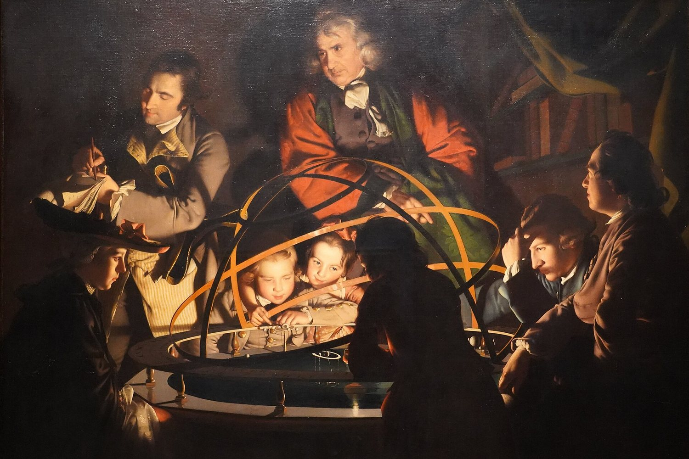
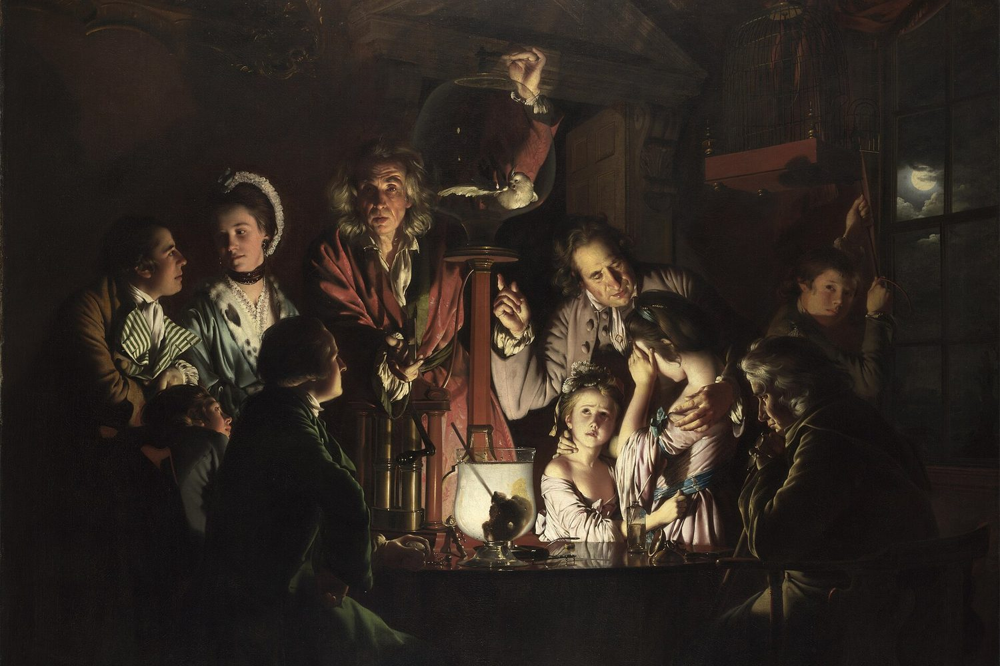
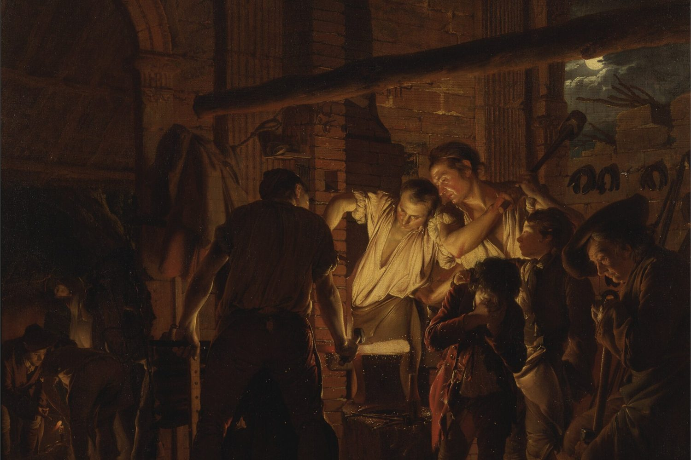

<table>
<tr>
<td width="40%" align="center">
 
<i>A Philosopher Lecturing on the Orrery Joseph Wright of Derby (1766)</i>
</td>
<td width="60%" align="center">

### Hi, I'm Thinh 👋
Customer Success · Human-led AI CSM · Learner

🇬🇧 **English** · 🇻🇳 [Tiếng Việt](README.vi.md)

Hello, I work in Customer Success and am a curious person who loves learning new things. With
AI applications, my current work principle is that humans remain the primary drivers while AI
amplifies capabilities and boosts human efficiency. This GitHub is where I share what I've
learned, liked, and done throughout this journey.

✍️ My personal blog — [Beyond Features](https://thinhle1.sg.larksuite.com/app/JmQMbi5MsakZaisFNU6l248ugBd?pageId=pgeCryHXZxtoxnXi)

📫 Contact me — [LinkedIn](https://www.linkedin.com/in/thinhlk41/) · [Email](mailto:kimthinh.41@gmail.com)

</td>
</tr>
</table>

### 🛠️ The things I have built:

<table>
<tr>
<td width="60%" align="left" valign="top">

**For customer success:**
- [customer-success-101](https://github.com/nixthinh-bit/customer-success-101): a practitioner's guide to CS concepts, metrics, and vocabulary, with a full ebook
- [csm-beyond-features](https://github.com/nixthinh-bit/csm-beyond-features): a portable AI mentor prompt that teaches CS fundamentals, metrics, and career path through guided Q&A

**For GTM team:**
- [zoom-demo-video](https://github.com/nixthinh-bit/zoom-demo-video): single-file browser tool for CapCut-style Ken Burns zoom and highlighting the key parts while recording a demo video
- [lark-base-architect](https://github.com/nixthinh-bit/lark-base-architect): plain-language requirement → live Lark Base (interview → ERD → build → usage doc)
- [gtm-industry-researcher](https://github.com/nixthinh-bit/gtm-industry-researcher): industry name → source-cited industry report → product mapping with ranked POC hypotheses and discovery questions

</td>
<td width="40%" align="center">
 
<i>An Experiment on a Bird in an Air Pump Joseph Wright of Derby (1768)</i>
</td>
</tr>
</table>

---

<table>
<tr>
<td width="40%" align="center">
 
<i>The Alchemist Discovering Phosphorus Joseph Wright of Derby (1771)</i>
</td>
<td width="60%">

**For Lark's end users:**
- [lark-base-templates](https://github.com/nixthinh-bit/lark-base-templates): a growing collection of duplicate-able Lark Base templates, both EN/VN
- [lark-cli-onboarding](https://github.com/nixthinh-bit/lark-cli-onboarding): one link, one command → lark-cli + skills + token auto-refresh in Claude Code
- [lark-bridge-onboarding](https://github.com/nixthinh-bit/lark-bridge-onboarding): no-code setup for a Lark chatbot bridged to a local Claude Code / Codex CLI
- [lark-anyBase-report](https://github.com/nixthinh-bit/lark-anyBase-report): reads any Lark Base, asks your KPIs, returns an insight report as a Doc or message
- [lark-Baseview-helper](https://github.com/nixthinh-bit/lark-Baseview-helper): builds a custom Base "Data Table View" extension from an existing Base

</td>
</tr>
</table>

---

### ❤️ Things I found really cool:

<table>
<tr>
<td width="60%" align="left" valign="top">

- [beautiful-html-templates](https://github.com/zarazhangrui/beautiful-html-templates): A library of HTML slide templates
- [Taste Skill](https://github.com/Leonxlnx/taste-skill): open-source design taste for AI coding agents.
- [claude-howto](https://github.com/luongnv89/claude-howto): a visual, module-by-module tutorial for Claude Code, with templates and copy-paste configs from basics to agent orchestration

</td>
<td width="40%" align="center">
 
<i>The Blacksmith's Shop Joseph Wright of Derby (1771)</i>
</td>
</tr>
</table>

---
