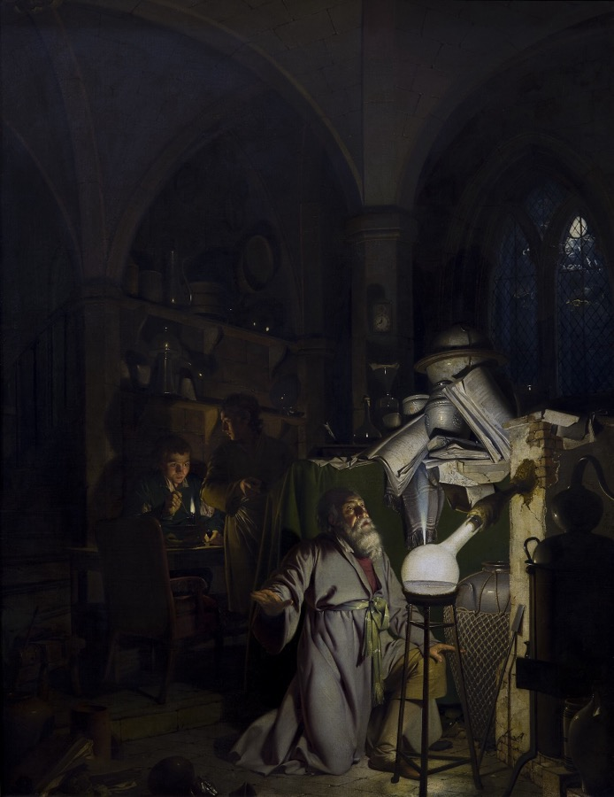
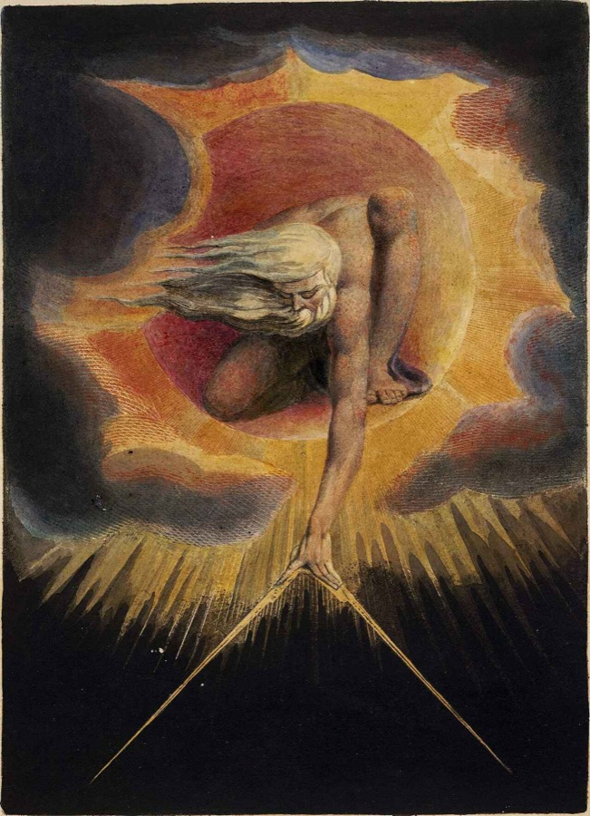
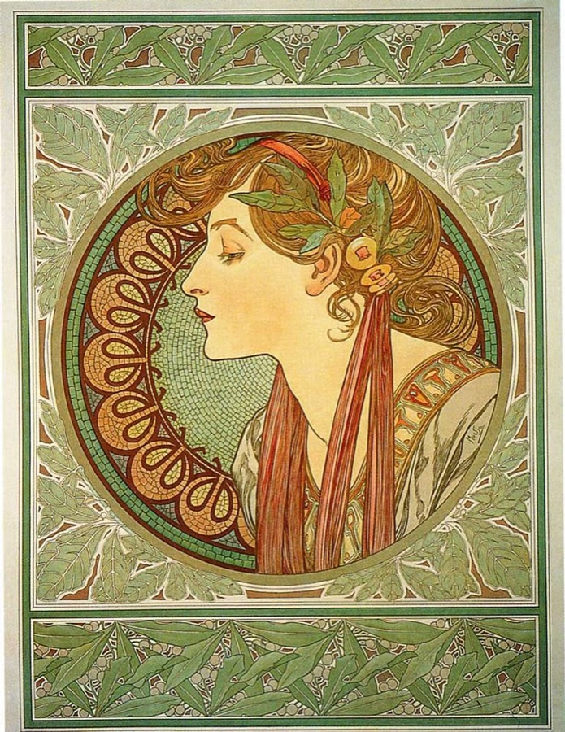

<table>
<tr>
<td width="40%">
 
<i>The Discovery of Phosphorus (1771) — Joseph Wright</i>
</td>
<td width="60%">

### Chào mọi người, mình là Thinh 👋
Customer Success · Human-led AI CSM · Learner

🇬🇧 [English](README.md) · 🇻🇳 **Tiếng Việt**

Mình làm Customer Success, và là người thích tò mò, ham học cái mới. Với các ứng dụng AI, nguyên
tắc làm việc hiện tại của mình là con người vẫn là người dẫn dắt chính, còn AI khuếch đại năng lực
và thúc đẩy hiệu quả. Trang GitHub này là nơi mình chia sẻ những điều đã học, đã thích, đã làm
trong suốt hành trình đó.

✍️ Blog cá nhân — [Beyond Features](https://thinhle1.sg.larksuite.com/app/JmQMbi5MsakZaisFNU6l248ugBd?pageId=pgeCryHXZxtoxnXi)
📫 Liên hệ — [LinkedIn](https://www.linkedin.com/in/thinhlk41/) · [Email](mailto:kimthinh.41@gmail.com)

</td>
</tr>
</table>

### 🛠️ Những thứ mình đã xây:

<table>
<tr>
<td width="60%">

**Cho Customer Success:**
- [customer-success-101](https://github.com/nixthinh-bit/customer-success-101): cẩm nang thực hành về khái niệm, chỉ số và thuật ngữ nghề CS, kèm ebook đầy đủ

**Cho đội GTM:**
- [zoom-demo-video](https://github.com/nixthinh-bit/zoom-demo-video): công cụ một file HTML chạy trên trình duyệt, tạo hiệu ứng zoom Ken Burns kiểu CapCut cho video
- [lark-base-architect](https://github.com/nixthinh-bit/lark-base-architect): yêu cầu bằng lời thường → Lark Base chạy được (phỏng vấn → ERD → build → tài liệu dùng)

</td>
<td width="40%">
 
<i>The Ancient of Days (1794) — William Blake</i>
</td>
</tr>
</table>

---

<table>
<tr>
<td width="45%">
 
<i>Lark ~ Feishu</i>
</td>
<td width="55%">

**Cho người dùng Lark:**
- [lark-base-templates](https://github.com/nixthinh-bit/lark-base-templates): bộ mẫu Lark Base bấm là nhân bản được, ngày càng nhiều, mỗi mẫu có link copy tiếng Anh và tiếng Việt
- [lark-cli-onboarding](https://github.com/nixthinh-bit/lark-cli-onboarding): một link, một lệnh → lark-cli + skill + tự refresh token trong Claude Code
- [lark-bridge-onboarding](https://github.com/nixthinh-bit/lark-bridge-onboarding): cài không cần biết code cho bot Lark nối tới Claude Code / Codex CLI chạy local
- [lark-anyBase-report](https://github.com/nixthinh-bit/lark-anyBase-report): đọc bất kỳ Lark Base, hỏi KPI của bạn, trả về báo cáo insight dạng Doc hoặc tin nhắn
- [lark-Baseview-helper](https://github.com/nixthinh-bit/lark-Baseview-helper): dựng extension "Data Table View" tuỳ chỉnh từ một Base có sẵn

</td>
</tr>
</table>

---

❤️ Những thứ mình thấy hay:

<table>
<tr>
<td width="71%">

- [beautiful-html-templates](https://github.com/zarazhangrui/beautiful-html-templates): thư viện mẫu slide HTML - của Zara Zhang
- [Taste Skill](https://github.com/Leonxlnx/taste-skill): gu thiết kế mã nguồn mở cho AI coding agent.

</td>
<td width="29%">
 
<i>Laurel (1901) — Alphonse Mucha</i>
</td>
</tr>
</table>
